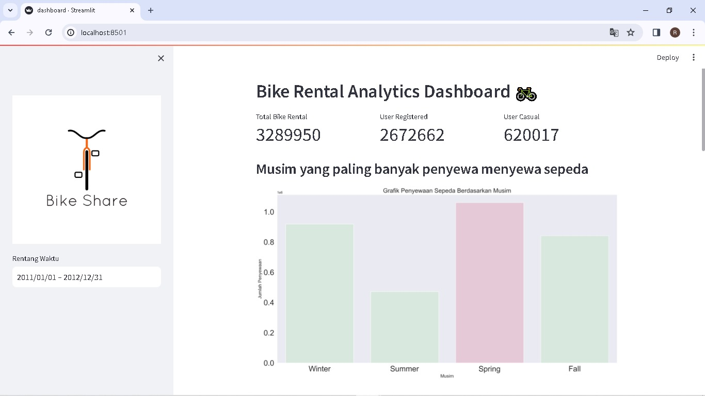
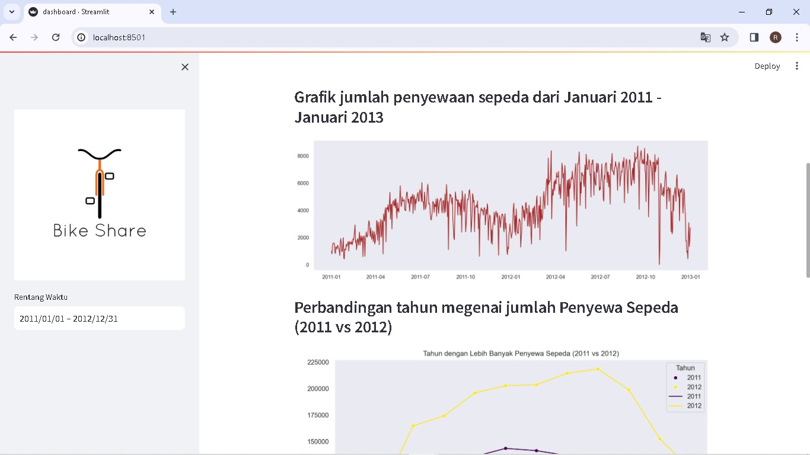
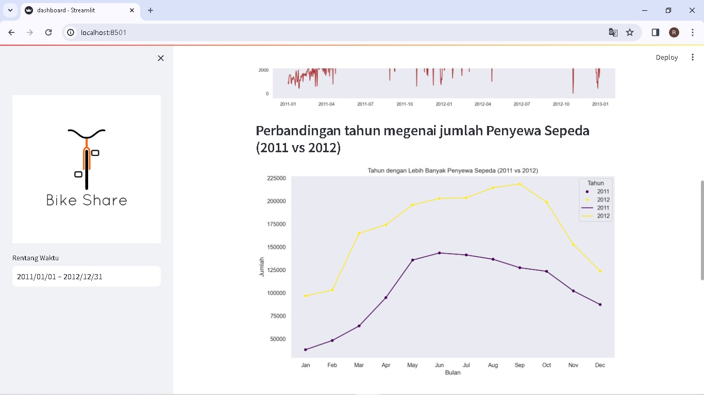
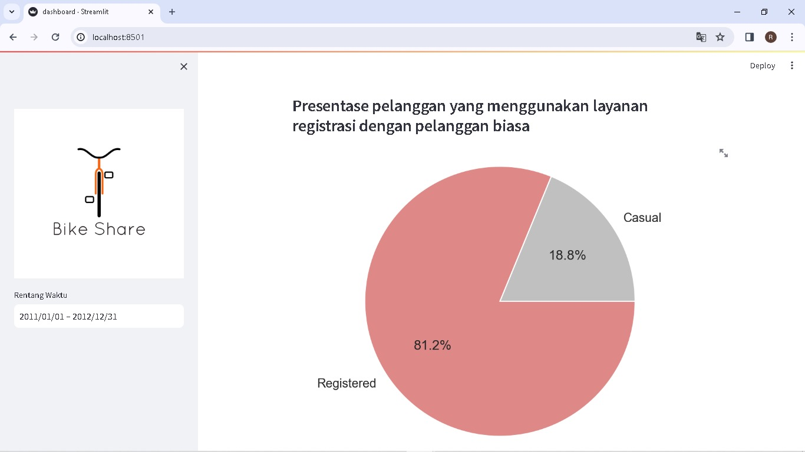

# Final Project "Belajar Analisis data menggunakan python"

In my "Learning Data Analysis with Python" course at dico, I completed a final project that involved analyzing data and creating a dashboard with a bike sharing dataset. In my report, I explained the steps I took from cleaning the data, exploring the data, to creating a data visualization. In addition, I also created a dashboard using the streamlit application.

### Process Analysis 
1. Prepare a minimum of 2 business questions
2. Data Wrangling: Gathering data, Assessing data, Cleaning data
3. Exploratory Data Analysis: Identify business questions to find answers in the data and then explore the data to understand patterns and relationships between variables.
4. Data Visualization: Create data visualizations that can answer the business questions being asked
5. Creating Dashboards: Deployment in Streamlit

### Directory Structure
```
├── dashboard
│   ├── dashboard.py
│   └── day_clean.csv
│   └── hour_clean.csv
├── data
│   ├── Readme.txt
│   ├── day.csv
|   └── hour.csv
├── image
│   ├── img1.jpeg
│   ├── img2.jpeg
|   └── img3.jpeg
|   └── img4.jpeg
├── README.md
├── notebook.ipynb
└── requirements.txt
```

### Get Started
**notebook.ipynb**
1. Access your preferred Integrated Development Environment (IDE) such as Jupyter Notebook or Google Colaboratory (for this example, we'll use Google Colab).
2. Open Google Colab
3. Create a New Notebook
4. Write Code
5. Run Code

**dashboard.py**
1. Unduh proyek pada notebook.ipynb menjadi file `.csv`
2. Gunakan `pip install streamlit` pada terminal Anda atau command prompt untuk menginstal Streamlit. Selain itu, pastikan library lain seperti `pandas, numpy, scipy, matplotlib, dan seaborn` sudah terinstal jika belum.
3. Harap jangan memindahkan file CSV karena file ini berfungsi sebagai sumber data. Simpanlah di dalam folder yang sama dengan `dashboard.py`.
4. Akses VSCode Anda dan jalankan berkas tersebut dengan menavigasi ke terminal dan memasukkan `streamlit run dashboard.py`.

### Preview




